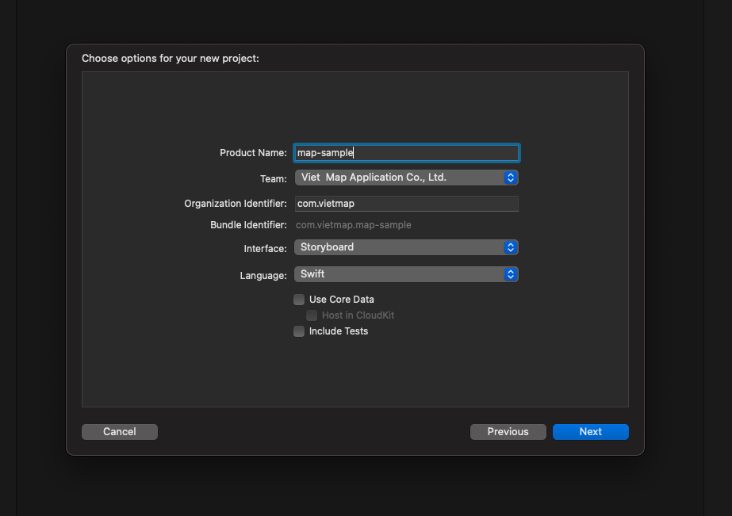
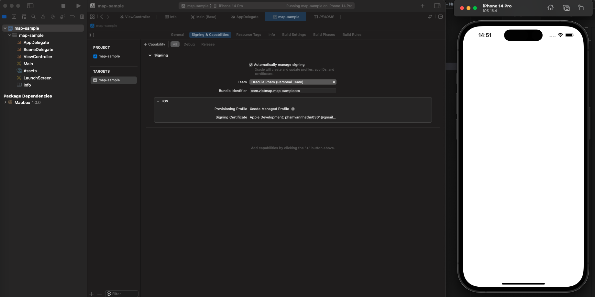
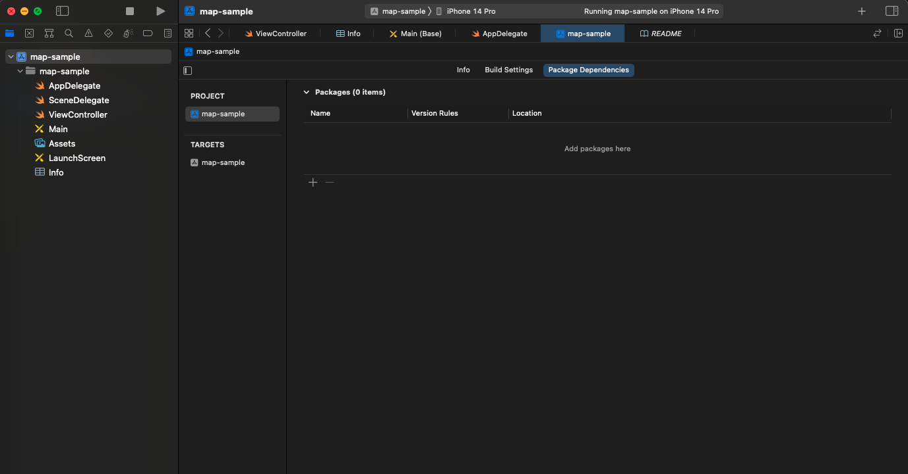
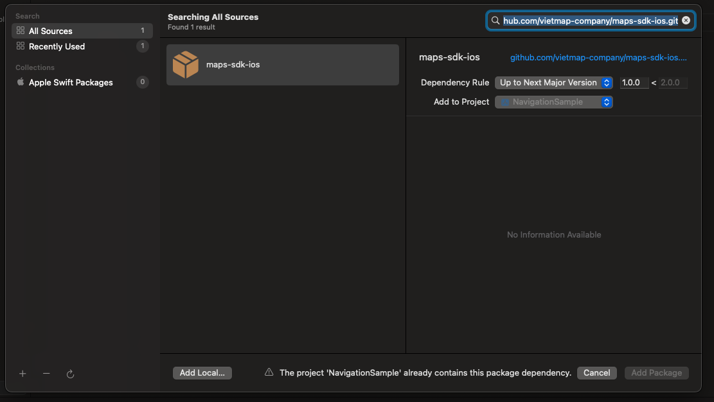
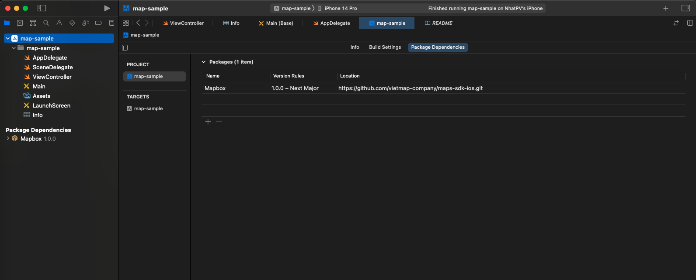

# Tài liệu hướng dẫn cài đặt VietMap Map iOS SDK

## Mục lục
1. [Tạo project Navigation với xcode.](/README.md#1-tạo-project-navigation-với-xcode)
2. [Import thư viện.](/README.md#2-import-thư-viện)
3. [Các sự kiện.](/README.md#3-các-sự-kiện)
4. [Xây dựng project](/README.md#4-xây-dựng-project)

## Cài đặt iOS SDK Map

### 1. Tạo project Navigation với xcode.

* Tạo project với Swift và Storyboard
Mở xcode, chọn File > New > Project



Đảm bảo project chạy thành công. Nếu thành công sẽ nhận được layout như hình dưới.



### 2. Import thư viện.

Chọn Package Dependencies và thêm các thư viện sau:<br>
```
https://github.com/vietmap-company/maps-sdk-ios.git
```



Đảm bảo chọn Dependency Rule > Branch > main để sử dụng thư viện mới nhất.



Sau khi hoàn thành sẽ được kết quả.



### 3. Các sự kiện.

[regionIsChangingWith](): Phương thức được gọi khi vùng hiển thị của mapview đang thay đổi.

[didChange](): Phương thức được gọi khi chế độ theo dõi người dùng trên mapview thay đổi.

[mapViewDidFinishLoadingMap](): Phương thức được gọi khi bản đồ trên mapview đã hoàn tất quá trình tải và hiển thị.

[mapViewDidStopLocatingUser](): Phương thức được gọi khi MGLMapView dừng quá trình xác định vị trí người dùng.

[mapViewWillStartLoadingMap](): Phương thức được gọi khi MGLMapView bắt đầu quá trình tải dữ liệu bản đồ.

[mapViewWillStartLocatingUser](): Phương thức được gọi khi MGLMapView bắt đầu quá trình xác định vị trí của người dùng.

[mapViewWillStartRenderingMap](): Phương thức được gọi khi MGLMapView bắt đầu quá trình render bản đồ.

[mapViewWillStartRenderingFrame](): Phương thức được gọi khi MGLMapView bắt đầu quá trình render một khung hình của bản đồ.

[didFinishLoading](): Phương thức được gọi khi MGLMapView hoàn thành việc tải dữ liệu và giao diện cho bản đồ.

[didSelect](): Phương thức được gọi khi một annotation trên bản đồ được chọn.

[didDeselect](): Phương thức được gọi khi một annotation trên bản đồ không còn được chọn.

[didSingleTapAt](): Phương thức được gọi khi người dùng thực hiện một cú nhấp đơn trên bản đồ.

[regionDidChangeAnimated](): Phương thức được gọi khi vùng hiển thị của bản đồ thay đổi, bao gồm khi người dùng di chuyển, thu phóng hoặc xoay bản đồ.

[regionWillChangeAnimated](): Phương thức được gọi trước khi vùng hiển thị của bản đồ sắp thay đổi.

[mapViewDidFailLoadingMap](): Phương thức được gọi khi việc tải bản đồ không thành công với một lỗi cụ thể.

[didUpdate: MGLUserLocation](): Phương thức được gọi khi thông tin vị trí của người dùng được cập nhật trên bản đồ.

[mapViewDidFinishRenderingMap](): Phương thức được gọi khi quá trình vẽ bản đồ hoàn tất.

[mapViewDidBecomeIdle](): Phương thức được gọi khi bản đồ đã kết thúc các hoạt động và trở thành trạng thái trống rỗng.

[didFailToLocateUserWithError](): Phương thức được gọi khi định vị người dùng trên bản đồ gặp lỗi.

[tapOnCalloutFor](): Phương thức được gọi khi người dùng chạm vào phần callout của một annotation trên bản đồ.

[mapViewDidFinishRenderingFrame](): Phương thức được gọi sau khi một frame của bản đồ đã được hoàn thiện việc vẽ trên màn hình.

[shapeAnnotationIsEnabled](): Phương thức này cho phép bạn điều khiển việc kích hoạt các annotation hình dạng trên bản đồ. Trả về giá trị true hoặc false để chỉ định xem annotation hình dạng có được kích hoạt hay không.

[didAdd: MGLAnnotationView](): Phương thức được gọi sau khi các MGLAnnotationView mới được thêm vào bản đồ.

[didSelect: MGLAnnotationView](): Phương thức được gọi khi một MGLAnnotationView trên bản đồ được chọn.

[didDeselect: MGLAnnotationView](): Phương thức được gọi khi một MGLAnnotationView trên bản đồ không còn được chọn nữa.

[alphaForShapeAnnotation](): Phương thức này cho phép bạn chỉ định giá trị alpha (độ trong suốt) cho một MGLShape trên bản đồ. Giá trị alpha là một số từ 0.0 đến 1.0, với 0.0 là hoàn toàn trong suốt và 1.0 là không trong suốt.

[viewFor: MGLAnnotation](): Phương thức này được sử dụng để cung cấp một MGLAnnotationView tùy chỉnh cho một MGLAnnotation cụ thể trên bản đồ.

[imageFor: MGLAnnotation](): Phương thức này được sử dụng để cung cấp một MGLAnnotationImage tùy chỉnh cho một MGLAnnotation cụ thể trên bản đồ.

[annotationCanShowCallout](): Phương thức này được sử dụng để xác định xem một MGLAnnotation có thể hiển thị callout hay không. Để có thể xác định xem một MGLAnnotation cụ thể có thể hiển thị callout hay không bằng cách trả về giá trị true hoặc false.

[calloutViewFor](): Phương thức này được sử dụng để tạo và tùy chỉnh giao diện của callout view cho một MGLAnnotation cụ thể.

[strokeColorForShapeAnnotation](): Phương thức này được sử dụng để cung cấp màu sắc viền cho một MGLShape (chẳng hạn như MGLPolyline hoặc MGLPolygon) cụ thể.

[fillColorForPolygonAnnotation](): Phương thức này được sử dụng để cung cấp màu sắc cho một MGLPolygon cụ thể trên bản đồ.

[leftCalloutAccessoryViewFor](): Phương thức này được sử dụng để cung cấp một UIView làm phần tử bổ sung bên trái của callout cho một MGLAnnotation cụ thể.

[lineWidthForPolylineAnnotation](): Phương thức này được sử dụng để cung cấp độ dày của đường polyline cho một MGLPolyline cụ thể.

[rightCalloutAccessoryViewFor](): Phương thức này được sử dụng để cung cấp một UIView làm giao diện bổ sung bên phải của gợi ý cho một MGLAnnotation cụ thể.

[calloutAccessoryControlTapped](): Phương thức này được gọi khi người dùng nhấn vào các phần tử giao diện bổ sung (accessory control) trong gợi ý cho một MGLAnnotation cụ thể.

[shouldChangeFrom](): Phương thức này được gọi khi trạng thái camera của bản đồ sắp thay đổi, cho phép bạn kiểm tra và quyết định xem liệu sự thay đổi đó có nên được thực hiện hay không.

[mapViewUserLocationAnchorPoint](): Phương thức này cho phép bạn xác định điểm neo (anchor point) của biểu tượng vị trí người dùng trên bản đồ.

[didFailToLoadImage](): Phương thức này được gọi khi không thể tải được hình ảnh với tên được cung cấp.

[shouldRemoveStyleImage](): Phương thức này được gọi khi hình ảnh trong style đang được sử dụng và có yêu cầu xóa nó.

[didChangeLocationManagerAuthorization](): Phương thức này được gọi khi quyền truy cập vị trí của người dùng thay đổi trong ứng dụng.

[styleForDefaultUserLocationAnnotationView](): Phương thức này được sử dụng để tùy chỉnh giao diện của đánh dấu vị trí người dùng mặc định trên bản đồ.

### 3. Xây dựng project.

Yêu cầu quyền truy cập vị trí thiết bị.

```
<key>NSLocationAlwaysAndWhenInUseUsageDescription</key>
<string>Get user location</string>
<key>NSLocationAlwaysUsageDescription</key>
<string>Get user location</string>
<key>NSLocationWhenInUseUsageDescription</key>
<string>Get user location</string>
<key>UIBackgroundModes</key>
<array>
    <string>audio</string>
    <string>location</string>
</array>
```

#### Sample Code

```swift
import UIKit
import Mapbox

class ViewController: UIViewController {
    var mapView: MGLMapView!
    var coordinates: [CLLocationCoordinate2D] = []
    override func viewDidAppear(_ animated: Bool) {
        super.viewDidAppear(animated)
        
        if #available(iOS 10.0, *) {
            UNUserNotificationCenter.current().requestAuthorization(options: [.badge, .alert, .sound]) { _,_ in
                DispatchQueue.main.async {
                    CLLocationManager().requestWhenInUseAuthorization()
                }
            }
        }
    }
    
    override func viewDidLoad() {
        super.viewDidLoad()
        startMapView()
        drawPolygon()
    }
    
    
    func startMapView() {
        mapView = MGLMapView(frame: view.bounds, styleURL: URL(string: "STYLE_URL_HERE"))
        mapView.autoresizingMask = [.flexibleWidth, .flexibleHeight]
        mapView.delegate = self
        mapView.userTrackingMode = .follow
       
        let singleTap = UILongPressGestureRecognizer(target: self, action: #selector(didLongPress(tap:)))
        mapView.gestureRecognizers?.filter({ $0 is UILongPressGestureRecognizer }).forEach(singleTap.require(toFail:))
        mapView.addGestureRecognizer(singleTap)
        view.addSubview(mapView)
    }
    
    func drawPolyline() {
        let polyline = MGLPolyline(coordinates: coordinates, count: UInt(coordinates.count))
        mapView.addAnnotation(polyline)
    }
    
    func drawPolygon() {
        let coordinates = [
            CLLocationCoordinate2D(latitude: 10.745863, longitude: 106.655122),
            CLLocationCoordinate2D(latitude: 10.753557, longitude: 106.649735),
            CLLocationCoordinate2D(latitude: 10.765662, longitude: 106.681285),
            CLLocationCoordinate2D(latitude: 10.750961, longitude: 106.683948)
        ]
        let polygon = MGLPolygon(coordinates: coordinates, count: UInt(coordinates.count))
        mapView.addAnnotation(polygon)
    }
    
    // MARK: Gesture Recognizer Handlers
    @objc func didLongPress(tap: UILongPressGestureRecognizer) {
        guard let mapView = mapView else { return }
        if (coordinates.isEmpty) {
            coordinates.append((mapView.userLocation?.location?.coordinate)!)
        }
        let point = mapView.convert(tap.location(in: mapView), toCoordinateFrom: mapView)
        let annotation = MGLPointAnnotation()
        annotation.coordinate = point
        annotation.title = "Point Here"
        coordinates.append(point)
        mapView.addAnnotation(annotation)
        drawPolyline()
    }
}

extension ViewController: MGLMapViewDelegate {
    func mapView(_ mapView: MGLMapView, imageFor annotation: MGLAnnotation) -> MGLAnnotationImage? {
        let image = UIImage(systemName: "car")!
        image.withTintColor(UIColor.red)
        let annotationImage = MGLAnnotationImage(image: image, reuseIdentifier: "customAnnotation")

        return annotationImage
    }
    
    func mapView(_ mapView: MGLMapView, annotationCanShowCallout annotation: MGLAnnotation) -> Bool {
        return true
    }
    
    func mapView(_ mapView: MGLMapView, leftCalloutAccessoryViewFor annotation: MGLAnnotation) -> UIView? {
        let imageView = UIImageView(image: UIImage(named: "leftAccessoryImage"))
        return imageView
    }

    func mapView(_ mapView: MGLMapView, rightCalloutAccessoryViewFor annotation: MGLAnnotation) -> UIView? {
        let button = UIButton(type: .detailDisclosure)
        return button
    }
    
    func mapView(_ mapView: MGLMapView, fillColorForPolygonAnnotation annotation: MGLPolygon) -> UIColor {
        return UIColor.red.withAlphaComponent(0.5)
    }
}
```